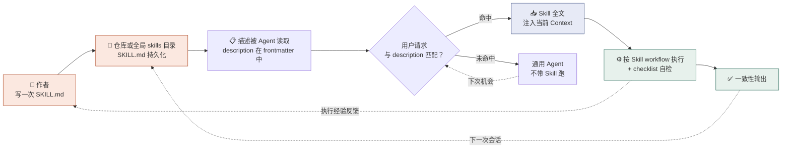
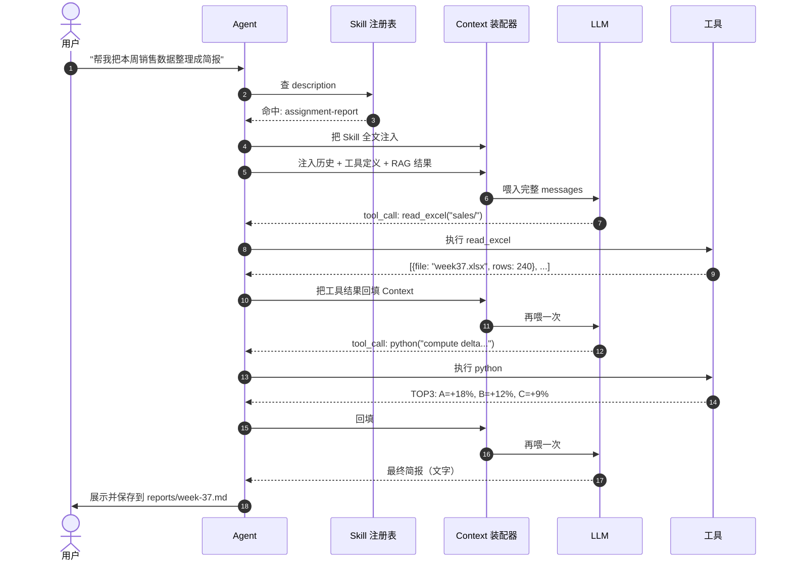

# 三个概念的关系：Agent × Context × Skill

> 配套学习资料的图示版。三份概念学习资料分别在：`learning-materials/agent.html`、`learning-materials/llm-context.html`、`learning-materials/skill.html`。本文件用文字 + 表格 + Mermaid 图说明这三者如何咬合在一起。

## 一句话总览

**Skill** 是"按需加载的指令手册"——一份静态的 Markdown，写一次，长期复用；
**Context** 是"本次推理的全部输入"——把 Skill、用户消息、历史对话、工具结果按某种顺序拼在一起；
**Agent** 是"读 Context、按 Skill 干活、再把工具结果写回 Context"的执行者。

口诀：**Skill 装进 Context，Context 喂给 Agent，Agent 又把新观察写回 Context**——三个角色构成一个闭环。

---

## 一、三者角色分工

| 维度 | Agent | Context | Skill |
|---|---|---|---|
| **本质** | 执行者 + 循环 | 一次推理的全部输入 | 静态的指令包 |
| **物理形态** | 运行中的程序 / API | 一组消息列表 / token 流 | 一个 Markdown 文件（带 YAML frontmatter） |
| **生命周期** | 会话期间持续运行 | 每次 LLM 调用都重建 | 作者更新才改变 |
| **由谁"使用"** | 读 Context、再行动 | 被 Agent 当作"那一页卷子" | 被 Agent 选中后注入 Context |
| **好坏的衡量** | 任务完成度 + 稳定性 | 信息完整度 + 排序合理度 | 是否覆盖了高频场景 + 触发描述是否清晰 |

---

## 二、Mermaid 图 1：Context 如何影响 Agent 的工作

下图说明：在 Agent 的一次循环里，Context 是被怎么读、怎么改的。注意工具调用产生的新结果**也要回填进 Context**，否则下一次 LLM 决策就成了"睁眼瞎"。

```mermaid
flowchart TD
    subgraph Inputs["📥 Context 输入（每次推理都重新组装）"]
        S[System Prompt<br/>角色 / 规则]
        SK[Skill Body<br/>按 description 匹配后注入]
        H[History<br/>历史 user / assistant 轮次]
        T[Tool Definitions<br/>有哪些工具可用]
        R[RAG Results<br/>按 query 检索出的资料]
    end

    LLM[LLM<br/>读 Context、产出下一步]

    subgraph Decision{"思考：要不要调工具？"}
        YES["调（输出 tool_call）"]
        NO["不调（直接产出文字）"]
    end

    Tools["🛠️ 工具执行<br/>读文件 / 调 API / 跑代码"]
    Obs[Observation<br/>工具返回值]

    Inputs --> LLM
    LLM --> Decision
    YES --> Tools
    Tools --> Obs
    Obs -.新观察回填.-> Inputs
    NO --> Output[最终回答<br/>写回 Context 并展示给用户]

    style Inputs fill:#e7eaf6,stroke:#3b4d80
    style SK fill:#fbe8e0,stroke:#b14e2b
    style LLM fill:#e7f1ec,stroke:#2f6f5e
    style Decision fill:#fff8e0,stroke:#b14e2b
```

**这一图想说明**：Context 不是"读一次就完事"的静态输入——它是一份**会增长、会变脏、被多次重读**的工作空间。

---

## 三、Context 影响 Agent 工作的 5 个具体机制

| # | 机制 | 没有它会怎样 |
|---|---|---|
| 1 | **冷启动**（System Prompt + Few-shot）让 Agent 知道"我是谁、该答成什么样" | 模型答非所问、文风乱 |
| 2 | **Skill 注入**让 Agent 按特定流程办事 | 同一份对话里反复绕弯子 |
| 3 | **历史对话**让 Agent 承接上文 | 用户每次都要重述背景 |
| 4 | **检索结果（RAG）**让 Agent 看到"事实"而非"想象" | 模型幻觉、编造引用 |
| 5 | **工具返回值回填**让下一次决策看得见上一次结果 | Agent 在错误上一错到底 |

> **一句话总结**：Context 决定 Agent 在每一步<em>看见什么</em>。看得见对的东西，Agent 才对；看见错的、缺失的、混乱的内容，Agent 一定跑歪。

---

## 四、Mermaid 图 2：Skill 如何沉淀可复用的任务知识

下图说明：写一次 Skill，怎样变成"今天用、明天也用、自己用、别人也用"的可复用知识。



**这一图想说明**：Skill 的可复用性有四道闸——

1. **持久化**（磁盘文件）让它跨会话存在；
2. **可发现**（frontmatter description）让它被 Agent 主动找到；
3. **可加载**（命中即注入）让它在新会话里无须重新说明；
4. **可自检**（checklist）让它每次输出的下限稳定。

---

## 五、Skill 沉淀知识的 4 条路径

| 路径 | 沉淀什么 | 沉淀到什么文件 |
|---|---|---|
| **首次提炼** | "我发现同一段流程反复要讲"→ 写成 Skill | `.workbuddy/skills/<name>/SKILL.md` |
| **修订优化** | "这个 Skill 的第 3 步经常出错"→ 修一修 | 同一个 SKILL.md，commit 时写清改动 |
| **跨项目复用** | "这个 Skill 我也想在新项目用"→ 把目录拷到新项目，或放全局 | 同上 / `~/.workbuddy/skills/` |
| **团队共享** | "我希望同事也用"→ push 到 Git，告诉他拉一下 | GitHub 仓库本身 |

---

## 六、端到端时序：一次完整请求经过三者的轨迹



这一时序图把"Skill 注入 → Context 装配 → Agent 行动 → 工具结果回填 → 再装配"的闭环画在一张图上。**这就是 AI 应用工程当下的标准骨架。**

---

## 七、自检

<details><summary>1. 用一句话说出 Agent / Context / Skill 的关系。</summary>Skill 是静态指令包；按需注入 Context；Context 喂给 Agent；Agent 的工具结果回填 Context——三者构成闭环。</details>

<details><summary>2. Skill 不注入 Context，Agent 还能跑吗？</summary>能。Skill 是稳定器，不是引擎。没有 Skill 的 Agent 也能循环与调工具——只是输出稳定性变差。</details>

<details><summary>3. Context 越多越好吗？</summary>不一定。Context 过长反而稀释注意力，"Lost in the Middle" 是经典现象。Context 工程的目标是<strong>在对的位置放对的内容</strong>。</details>

<details><summary>4. Skill 的 description 为什么重要？</summary>它是 Agent 决定"该不该加载这个 Skill"的唯一线索；写得模糊，Skill 永远用不上。</details>

<details><summary>5. 为什么说 Skill "沉淀"知识？</summary>因为 Skill 一旦写入磁盘，就跨会话、跨电脑、跨使用者地持续生效——把一次性的口头默契变成了可携带的版本化文档。</details>

<details><summary>6. 给我一个三者都用得上的真实例子。</summary>用户在 WorkBuddy 里说"帮我提交今天的作业代码"。Agent：① 匹配到 Skill <code>assignment-submit</code>；② 把 Skill 注入 Context 并补充 git 当前状态、commit 历史；③ Agent 调 <code>git</code> 工具做提交；④ 工具结果回填；⑤ Skill 的 checklist 自检（commit message 体例、是否勾上工时标签）；⑥ 输出提交报告。</details>

---

## 八、参考资料

- Yao et al., 2022. *ReAct: Synergizing Reasoning and Acting in Language Models*. <https://arxiv.org/abs/2210.03629>
- Liu et al., 2023. *Lost in the Middle*. <https://arxiv.org/abs/2307.03172>
- Anthropic. *Building effective agents*. <https://www.anthropic.com/research/building-effective-agents>
- Anthropic Engineering. *Effective context engineering for AI agents*. <https://www.anthropic.com/engineering/effective-context-engineering-for-ai-agents>
- WorkBuddy 官方文档。 <https://www.workbuddy.cn/docs/workbuddy/Overview>
- OpenAI. *Function calling*. <https://platform.openai.com/docs/guides/function-calling>
